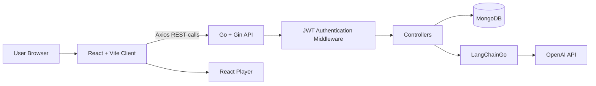

# MagicStream 🎬✨

A full-stack movie streaming demo platform built with **React**, **Go**, **Gin**, **MongoDB**, **JWT authentication**, and **LangChainGo + OpenAI**.

MagicStream demonstrates a modern client-server architecture for browsing movies, authenticating users, streaming movie/video content, generating personalized recommendations, and using an LLM to classify administrator movie reviews into ranking categories.

> **Note:** This project simulates a streaming platform for learning and portfolio purposes. Movie playback in the client is handled through `react-player` using video IDs/URLs stored with the movie data.

---

## ✨ Key Features

- 🎬 Browse a catalog of movies from MongoDB
- 🔐 User registration, login, logout, and refresh-token flow
- 🍪 JWT access and refresh tokens stored in HttpOnly cookies
- 🛡️ Protected frontend and backend routes
- 👤 Role-aware authorization with an `ADMIN` review workflow
- ❤️ User favorite genres stored in the user profile
- 🎯 Personalized movie recommendations based on favorite genres and movie ranking
- 🤖 AI-assisted admin review classification using **LangChainGo + OpenAI**
- ⭐ AI-generated review categories such as `Excellent`, `Good`, `Okay`, `Bad`, and `Terrible`
- ▶️ Movie/video playback using **React Player**
- ⚡ REST API built with **Go + Gin**
- 🍃 MongoDB persistence for users, movies, genres, rankings, and tokens
- 🌐 Configurable CORS support for frontend/backend deployment
- 📦 Included JSON seed data for movies, genres, rankings, and users

---

## 🧠 How the AI Feature Works

MagicStream uses AI specifically in the **administrator review-ranking workflow**.

When an administrator submits a movie review:

1. The backend loads the valid ranking labels from MongoDB.
2. It builds a prompt containing the allowed ranking names.
3. The review text is sent to an OpenAI model through **LangChainGo**.
4. The LLM returns a ranking label such as `Excellent`, `Good`, `Okay`, `Bad`, or `Terrible`.
5. The backend maps the returned label to its numeric ranking value.
6. The movie document is updated with the admin review and ranking.

The recommendation endpoint then uses the authenticated user's **favorite genres** and the stored movie ranking to return relevant movies, ordered by ranking.

```text
Admin Review
    │
    ▼
Go / Gin Controller
    │
    ├── Load ranking labels from MongoDB
    │
    ▼
LangChainGo
    │
    ▼
OpenAI
    │
    ▼
Ranking Label
    │
    ▼
MongoDB Movie Ranking
```

---

## 🏗️ Architecture



### Application flow

```text
React Client
   │
   ├── Register / Login
   │       │
   │       ▼
   │   Go + Gin API
   │       │
   │       ├── bcrypt password hashing
   │       ├── JWT access token
   │       └── JWT refresh token
   │
   ├── Browse Movies ───────────────► MongoDB
   │
   ├── Recommended Movies
   │       │
   │       ├── User favorite genres
   │       └── Movie ranking
   │
   ├── Stream Movie ────────────────► React Player
   │
   └── Admin Review
           │
           ├── LangChainGo
           ├── OpenAI
           └── Ranking stored in MongoDB
```

---

## 🛠️ Tech Stack

### Frontend

| Technology | Purpose |
|---|---|
| **React 19** | Component-based frontend |
| **JavaScript** | Client-side application logic |
| **Vite** | Frontend development server and build tool |
| **React Router** | Client-side routing and protected pages |
| **Axios** | REST API communication |
| **React Bootstrap** | UI components and responsive layout |
| **Bootstrap 5** | Styling and responsive design |
| **React Player** | Video/movie playback |
| **Font Awesome** | UI icons |

### Backend

| Technology | Purpose |
|---|---|
| **Go 1.24** | Backend programming language |
| **Gin / gin-gonic** | HTTP server and REST API framework |
| **MongoDB Go Driver** | Database access |
| **JWT** | Access and refresh token authentication |
| **bcrypt** | Password hashing |
| **validator/v10** | Request/model validation |
| **gin-contrib/cors** | CORS configuration |
| **godotenv** | Environment-variable loading |

### AI / Generative AI

| Technology | Purpose |
|---|---|
| **LangChainGo** | LLM integration/orchestration |
| **OpenAI API** | AI-based review classification |
| **Prompt Engineering** | Constraining review classification to stored ranking labels |

### Database

| Technology | Purpose |
|---|---|
| **MongoDB** | Movies, users, genres, rankings, and authentication-token storage |

---

## 📂 Project Structure

```text
MagicStream-main/
│
├── Client/
│   └── magic-stream-client/
│       ├── public/
│       ├── src/
│       │   ├── api/              # Axios configuration
│       │   ├── assets/           # Frontend static assets
│       │   ├── components/
│       │   │   ├── header/
│       │   │   ├── home/
│       │   │   ├── login/
│       │   │   ├── movie/
│       │   │   ├── movies/
│       │   │   ├── recommended/
│       │   │   ├── register/
│       │   │   ├── review/
│       │   │   ├── spinner/
│       │   │   └── stream/
│       │   ├── context/          # Authentication context
│       │   ├── hooks/            # Custom React hooks
│       │   ├── App.jsx
│       │   └── main.jsx
│       ├── package.json
│       └── vite.config.js
│
├── Server/
│   └── MagicStreamServer/
│       ├── controllers/          # Movie and user request handlers
│       ├── database/             # MongoDB connection helpers
│       ├── middleware/           # Authentication middleware
│       ├── models/               # Go data models
│       ├── routes/               # Protected/unprotected REST routes
│       ├── utils/                # JWT/token utilities
│       ├── go.mod
│       └── main.go
│
├── magic-stream-seed-data/
│   ├── movies.json
│   ├── genres.json
│   ├── rankings.json
│   ├── users.json
│   ├── AddTestMovieDoc.json
│   └── AddTestUserDoc.json
│
├── .gitignore
└── README.md
```

---

## 🔐 Authentication & Authorization

MagicStream uses JWT-based authentication with two tokens:

- **Access token** — valid for approximately 24 hours
- **Refresh token** — valid for approximately 7 days

After login, the backend sets both values as **HttpOnly cookies**. Protected API routes use authentication middleware to validate the access token and populate user information such as the user ID and role in the Gin request context.

Passwords are never stored as plain text; registration hashes passwords using **bcrypt** before saving users to MongoDB.

### Role-based functionality

The review-update endpoint checks that the authenticated user has the `ADMIN` role before allowing an administrator review and AI-generated ranking to be stored.

---

## 🌐 API Endpoints

The backend runs on port `8080` by default.

### Public endpoints

| Method | Endpoint | Description |
|---|---|---|
| `GET` | `/hello` | Basic API health/demo endpoint |
| `GET` | `/movies` | Fetch all movies |
| `GET` | `/genres` | Fetch available movie genres |
| `POST` | `/register` | Register a new user |
| `POST` | `/login` | Authenticate a user and create JWT cookies |
| `POST` | `/logout` | Clear stored tokens and authentication cookies |
| `POST` | `/refresh` | Generate a new access/refresh token pair |

### Protected endpoints

| Method | Endpoint | Description |
|---|---|---|
| `GET` | `/movie/:imdb_id` | Fetch one movie by IMDb ID |
| `POST` | `/addmovie` | Add a movie for an authenticated user |
| `GET` | `/recommendedmovies` | Get personalized recommended movies |
| `PATCH` | `/updatereview/:imdb_id` | Update admin review and AI ranking; requires `ADMIN` role |

---

## 🎯 Recommendation Logic

Recommendations are personalized using data already associated with the authenticated user.

The server:

1. Reads the user ID from the authenticated request context.
2. Fetches the user's favorite genres from MongoDB.
3. Finds movies whose genres match any favorite genre.
4. Sorts matching movies by `ranking.ranking_value` in ascending order.
5. Limits the number of returned movies using `RECOMMENDED_MOVIE_LIMIT`.

This keeps recommendation retrieval efficient while allowing the movie ranking generated from the review workflow to influence ordering.

---

## 🚀 Getting Started

### Prerequisites

Install the following before running the project:

- **Go 1.24+**
- **Node.js + npm**
- **MongoDB** locally or a MongoDB Atlas cluster
- **OpenAI API key** for the AI review-ranking feature

---

## 1. Clone the Repository

```bash
git clone https://github.com/iitian-gopu/magic-stream.git
cd MagicStream-main
```

---

## 2. Configure the Backend

Move into the server directory:

```bash
cd Server/MagicStreamServer
```

Create a `.env` file:

```env
MONGODB_URI=mongodb://localhost:27017
DATABASE_NAME=magicstream

SECRET_KEY=replace_with_a_long_random_access_token_secret
SECRET_REFRESH_KEY=replace_with_a_different_long_random_refresh_secret

OPENAI_API_KEY=your_openai_api_key

BASE_PROMPT_TEMPLATE=Classify the following movie review as exactly one of these rankings: {rankings}. Return only the ranking name. Review: 

RECOMMENDED_MOVIE_LIMIT=5
ALLOWED_ORIGINS=http://localhost:5173
```

> Keep `.env` private and never commit production secrets to GitHub.

### Important JWT environment note

`SECRET_KEY` and `SECRET_REFRESH_KEY` are read by the current code when the token utility package initializes. If they are not being picked up from `.env` in your environment, export those variables before launching the Go process.

Install backend dependencies:

```bash
go mod download
```

Run the backend:

```bash
go run .
```

The API should be available at:

```text
http://localhost:8080
```

---

## 3. Seed MongoDB

The repository contains seed files inside `magic-stream-seed-data/`.

Typical collections used by the application are:

- `movies`
- `genres`
- `rankings`
- `users`

For a local MongoDB instance, you can import the JSON arrays with `mongoimport` from the repository root:

```bash
mongoimport --db magicstream --collection movies --file magic-stream-seed-data/movies.json --jsonArray
mongoimport --db magicstream --collection genres --file magic-stream-seed-data/genres.json --jsonArray
mongoimport --db magicstream --collection rankings --file magic-stream-seed-data/rankings.json --jsonArray
```

You can register application users from the UI/API instead of importing the sample `users.json` file.

---

## 4. Configure the Frontend

Open a second terminal and move into the client directory:

```bash
cd Client/magic-stream-client
```

Create a `.env` file:

```env
VITE_API_BASE_URL=http://localhost:8080
```

Install dependencies:

```bash
npm install
```

Start the development server:

```bash
npm run dev
```

The Vite application will normally be available at:

```text
http://localhost:5173
```

---

## 🖥️ Frontend Routes

| Route | Access | Purpose |
|---|---|---|
| `/` | Public | Movie catalog/home page |
| `/register` | Public | User registration |
| `/login` | Public | User authentication |
| `/recommended` | Protected | Personalized recommendations |
| `/review/:imdb_id` | Protected | Movie review workflow |
| `/stream/:yt_id` | Protected | Movie/video player |

---

## 🔄 Authentication Flow

```text
User Login
   │
   ▼
POST /login
   │
   ├── Fetch user from MongoDB
   ├── Verify bcrypt password
   ├── Generate JWT access token
   ├── Generate JWT refresh token
