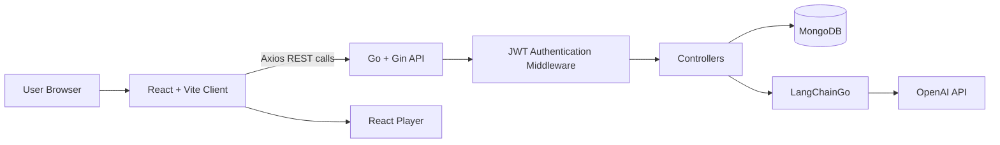

# MagicStream 🎬✨

A full-stack movie streaming demo platform built with **React**, **Go**, **Gin**, **MongoDB**, **JWT authentication**, and **LangChainGo + OpenAI**.

MagicStream demonstrates a modern client-server architecture for browsing movies, authenticating users, streaming movie/video content, generating personalized recommendations, and using an LLM to classify administrator movie reviews into ranking categories.

> **Note:** This project simulates a streaming platform for learning and portfolio purposes. Movie playback in the client is handled through `react-player` using video IDs/URLs stored with the movie data.

---

## ✨ Key Features

- 🎬 Browse a catalog of movies from MongoDB
- 🔐 User registration, login, logout, and refresh-token flow
- 🍪 JWT access and refresh tokens stored in HttpOnly cookies
- 🛡️ Protected frontend and backend routes
- 👤 Role-aware authorization with an `ADMIN` review workflow
- ❤️ User favorite genres stored in the user profile
- 🎯 Personalized movie recommendations based on favorite genres and movie ranking
- 🤖 AI-assisted admin review classification using **LangChainGo + OpenAI**
- ⭐ AI-generated review categories such as `Excellent`, `Good`, `Okay`, `Bad`, and `Terrible`
- ▶️ Movie/video playback using **React Player**
- ⚡ REST API built with **Go + Gin**
- 🍃 MongoDB persistence for users, movies, genres, rankings, and tokens
- 🌐 Configurable CORS support for frontend/backend deployment
- 📦 Included JSON seed data for movies, genres, rankings, and users

---

## 🧠 How the AI Feature Works

MagicStream uses AI specifically in the **administrator review-ranking workflow**.

When an administrator submits a movie review:

1. The backend loads the valid ranking labels from MongoDB.
2. It builds a prompt containing the allowed ranking names.
3. The review text is sent to an OpenAI model through **LangChainGo**.
4. The LLM returns a ranking label such as `Excellent`, `Good`, `Okay`, `Bad`, or `Terrible`.
5. The backend maps the returned label to its numeric ranking value.
6. The movie document is updated with the admin review and ranking.

The recommendation endpoint then uses the authenticated user's **favorite genres** and the stored movie ranking to return relevant movies, ordered by ranking.

```text
Admin Review
    │
    ▼
Go / Gin Controller
    │
    ├── Load ranking labels from MongoDB
    │
    ▼
LangChainGo
    │
    ▼
OpenAI
    │
    ▼
Ranking Label
    │
    ▼
MongoDB Movie Ranking
```

---

## 🏗️ Architecture



### Application flow

```text
React Client
   │
   ├── Register / Login
   │       │
   │       ▼
   │   Go + Gin API
   │       │
   │       ├── bcrypt password hashing
   │       ├── JWT access token
   │       └── JWT refresh token
   │
   ├── Browse Movies ───────────────► MongoDB
   │
   ├── Recommended Movies
   │       │
   │       ├── User favorite genres
   │       └── Movie ranking
   │
   ├── Stream Movie ────────────────► React Player
   │
   └── Admin Review
           │
           ├── LangChainGo
           ├── OpenAI
           └── Ranking stored in MongoDB
```

---

## 🛠️ Tech Stack

### Frontend

| Technology | Purpose |
|---|---|
| **React 19** | Component-based frontend |
| **JavaScript** | Client-side application logic |
| **Vite** | Frontend development server and build tool |
| **React Router** | Client-side routing and protected pages |
| **Axios** | REST API communication |
| **React Bootstrap** | UI components and responsive layout |
| **Bootstrap 5** | Styling and responsive design |
| **React Player** | Video/movie playback |
| **Font Awesome** | UI icons |

### Backend

| Technology | Purpose |
|---|---|
| **Go 1.24** | Backend programming language |
| **Gin / gin-gonic** | HTTP server and REST API framework |
| **MongoDB Go Driver** | Database access |
| **JWT** | Access and refresh token authentication |
| **bcrypt** | Password hashing |
| **validator/v10** | Request/model validation |
| **gin-contrib/cors** | CORS configuration |
| **godotenv** | Environment-variable loading |

### AI / Generative AI

| Technology | Purpose |
|---|---|
| **LangChainGo** | LLM integration/orchestration |
| **OpenAI API** | AI-based review classification |
| **Prompt Engineering** | Constraining review classification to stored ranking labels |

### Database

| Technology | Purpose |
|---|---|
| **MongoDB** | Movies, users, genres, rankings, and authentication-token storage |

---

## 📂 Project Structure

```text
MagicStream-main/
│
├── Client/
│   └── magic-stream-client/
│       ├── public/
│       ├── src/
│       │   ├── api/              # Axios configuration
│       │   ├── assets/           # Frontend static assets
│       │   ├── components/
│       │   │   ├── header/
│       │   │   ├── home/
│       │   │   ├── login/
│       │   │   ├── movie/
│       │   │   ├── movies/
│       │   │   ├── recommended/
│       │   │   ├── register/
│       │   │   ├── review/
│       │   │   ├── spinner/
│       │   │   └── stream/
│       │   ├── context/          # Authentication context
│       │   ├── hooks/            # Custom React hooks
│       │   ├── App.jsx
│       │   └── main.jsx
│       ├── package.json
│       └── vite.config.js
│
├── Server/
│   └── MagicStreamServer/
│       ├── controllers/          # Movie and user request handlers
│       ├── database/             # MongoDB connection helpers
│       ├── middleware/           # Authentication middleware
│       ├── models/               # Go data models
│       ├── routes/               # Protected/unprotected REST routes
│       ├── utils/                # JWT/token utilities
│       ├── go.mod
│       └── main.go
│
├── magic-stream-seed-data/
│   ├── movies.json
│   ├── genres.json
│   ├── rankings.json
│   ├── users.json
│   ├── AddTestMovieDoc.json
│   └── AddTestUserDoc.json
│
├── .gitignore
└── README.md
```

---

